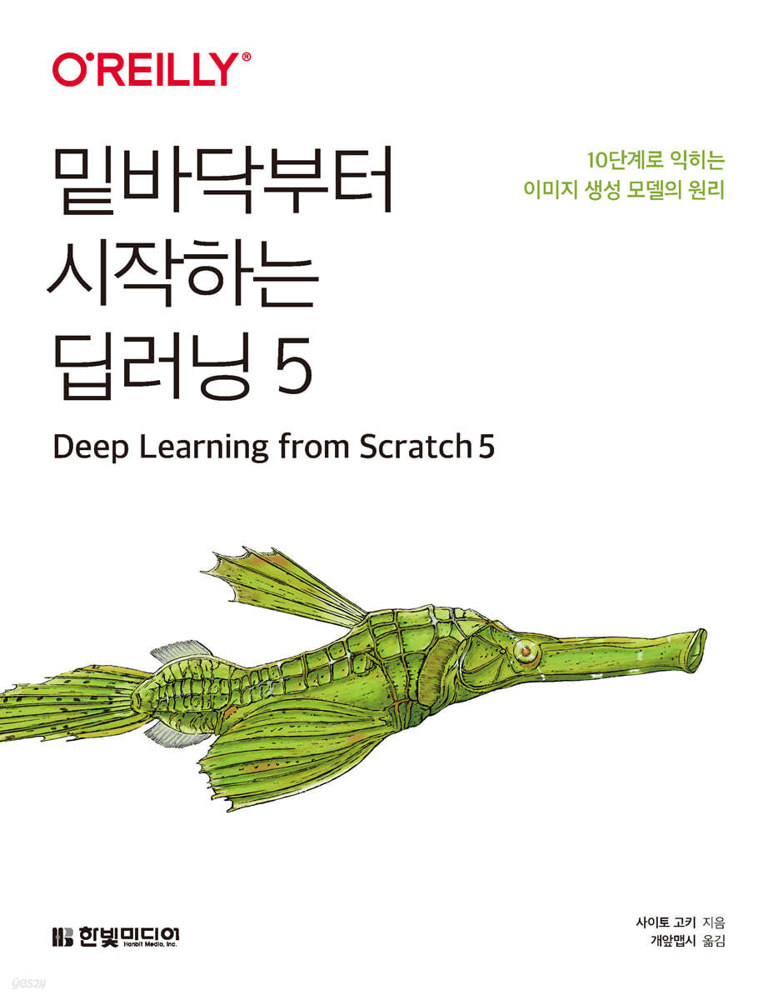

# Deep Learning from Scratch 5

## 1. 목표

- 생성형AI 중 Vision 쪽에 대해 공부를 하고자 함
- 역시 믿고 보는 밑시딥!!
- 차근차근 꼼꼼히 공부하고 정리하고자 함

## 2. 목차

| Chapter       | Notebook                                                     |
| :------------ | ------------------------------------------------------------ |
| 01. 정규 분포 | [01-normal.ipynb](https://github.com/ExcelsiorCJH/dl-from-scratch-5/blob/main/notebooks/01-normal.ipynb) |
| 02. 최대 우도 추정 | [02-mle.ipynb](https://github.com/ExcelsiorCJH/dl-from-scratch-5/blob/main/notebooks/02-mle.ipynb) |
|               |                                                              |
|               |                                                              |

## 3. 참고

- GitHub: [deep-learning-from-scratch-5](https://github.com/WegraLee/deep-learning-from-scratch-5)